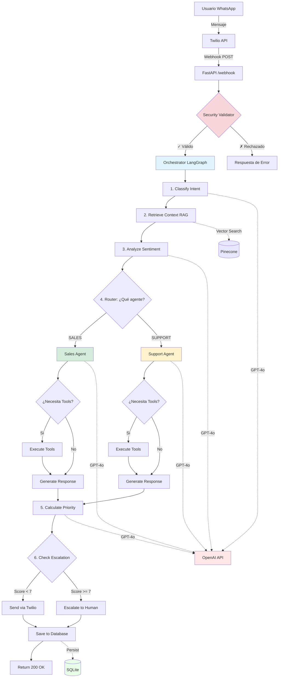

# 🎨 Diagrama de Arquitectura del Sistema

## Flujo Completo de Procesamiento de Mensajes

```mermaid
graph TD
    A[Usuario WhatsApp] -->|Mensaje| B[Twilio API]
    B -->|Webhook POST| C[FastAPI /webhook]
    
    C --> D{Security Validator}
    D -->|✓ Válido| E[Orchestrator LangGraph]
    D -->|✗ Rechazado| Z[Respuesta de Error]
    
    E --> F[1. Classify Intent]
    F --> G[2. Retrieve Context RAG]
    G --> H[3. Analyze Sentiment]
    H --> I{4. Router: ¿Qué agente?}
    
    I -->|SALES| J[Sales Agent]
    I -->|SUPPORT| K[Support Agent]
    
    J --> L{¿Necesita Tools?}
    K --> M{¿Necesita Tools?}
    
    L -->|Sí| N[Execute Tools]
    M -->|Sí| O[Execute Tools]
    
    N --> P[Generate Response]
    O --> Q[Generate Response]
    L -->|No| P
    M -->|No| Q
    
    P --> R[5. Calculate Priority]
    Q --> R
    
    R --> S{6. Check Escalation}
    S -->|Score < 7| T[Send via Twilio]
    S -->|Score >= 7| U[Escalate to Human]
    
    T --> V[Save to Database]
    U --> V
    V --> W[Return 200 OK]
    
    %% Servicios externos
    G -.->|Vector Search| X[(Pinecone)]
    F -.->|GPT-4o| Y[OpenAI API]
    J -.->|GPT-4o| Y
    K -.->|GPT-4o| Y
    H -.->|GPT-4o| Y
    R -.->|GPT-4o| Y
    
    V -.->|Persist| AA[(SQLite)]
    
    style E fill:#e1f5ff
    style J fill:#d4edda
    style K fill:#fff3cd
    style D fill:#f8d7da
    style X fill:#e7e7ff
    style Y fill:#ffe7e7
    style AA fill:#e7ffe7
```

